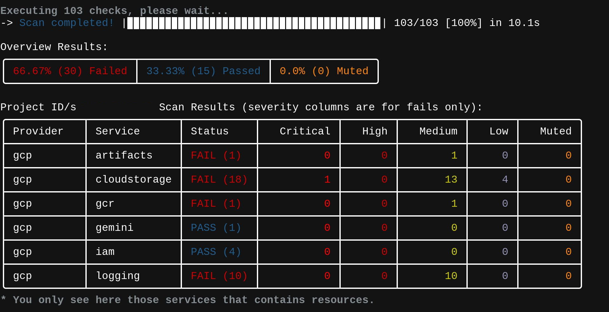
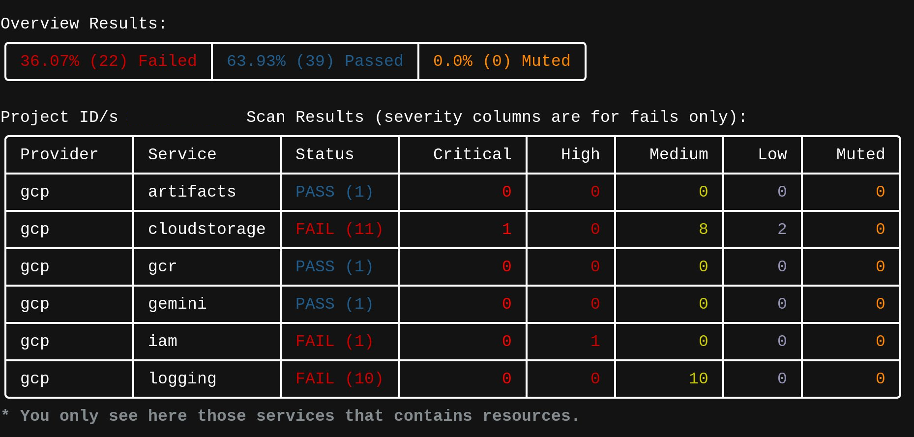

# GCP Cloud Security Assessment — Ember Gateway
### Production-grade security posture review for AWS & GCP environments

> **Service:** Cloud Security Health Check | **Platform:** Google Cloud Platform | **Tool:** Prowler v3+  
> **Scope:** 103 automated checks across CIS, SOC2, PCI, HIPAA, MITRE ATT&CK, NIS2, and additional frameworks  
> **Client:** Ember Cloud LLC (internal production audit)  
> **Auditor:** Dane Hately, Principal Cloud Architect | AWS SAA · Google Cloud ACE

---

## What This Assessment Delivers

A 48-hour security posture review that finds the misconfigurations standard engineering teams overlook — the gaps that become incidents, compliance failures, or surprise bills.

**Deliverables:**
- Full Prowler scan (100+ checks across 15+ compliance frameworks)
- Triage & risk analysis: *Fix Now / Fix Soon / Accept & Document*
- Remediation code (Terraform, console commands, or architecture guidance)
- Before/after compliance score comparison
- Executive summary suitable for customer security questionnaires or auditor review

**Engagement model:** Fixed price. Read-only access. No long-term commitment required.

---

## Environment Under Review

| Component | Technology |
|---|---|
| API layer | FastAPI on Google Cloud Run |
| Database | Google Firestore |
| Storage | Google Cloud Storage (4 buckets) |
| Telephony | Twilio (voice, SMS, voicemail) |
| Payments | Stripe |
| Auth | Session tokens + bcrypt PIN hashing |
| CI/CD | Cloud Build |

---

## Before — Initial Scan Results

**Date:** 2026-06-02  
**Checks executed:** 103  
**Initial pass rate:** 33.33% (15 passed / 30 failed)

**Date:** 2026-06-02

### Findings by Service

| Service | Result | Critical | High | Medium | Low |
|---|---|---|---|---|---|
| cloudstorage | FAIL (18) | 1 | 0 | 13 | 4 |
| logging | FAIL (10) | 0 | 0 | 10 | 0 |
| artifacts | FAIL (1) | 0 | 0 | 1 | 0 |
| gcr | FAIL (1) | 0 | 0 | 1 | 0 |
| iam | PASS (4) | — | — | — | — |
| gemini | PASS (1) | — | — | — | — |

### Compliance Framework Scores (Before)

| Framework | Fail | Pass |
|---|---|---|
| CIS 2.0 GCP | 52.38% | 47.62% |
| CIS 3.0 GCP | 52.63% | 47.37% |
| SOC2 GCP | 54.17% | 45.83% |
| PCI 4.0 GCP | 54.55% | 45.45% |
| HIPAA GCP | 55.56% | 44.44% |
| ISO 27001:2022 | 55.56% | 44.44% |
| MITRE ATT&CK | 57.89% | 42.11% |
| NIS2 GCP | 73.33% | 26.67% |
| CSA CCM 4.0 | 68.18% | 31.82% |

---

## Remediation Actions Performed

### 1. Container Vulnerability Scanning
Enabled `containerscanning.googleapis.com` and `containeranalysis.googleapis.com` on the project. All Cloud Run images are now scanned for known CVEs on every deployment.

### 2. Cloud Run Scaling Protection
Set `autoscaling.knative.dev/maxScale = "10"` to prevent runaway autoscaling from DDoS or viral traffic spikes. This is a financial safeguard, not a performance target.

### 3. Storage Hardening
Applied to `ember-audio-vault-us`, `ember-vmail_cloudbuild`, and `run-sources-ember-vmail-us-central1`:
- **Object Versioning** — protects customer voicemail recordings from accidental deletion
- **Soft Delete** (7 days) — recovery window for deleted objects
- **Uniform Bucket-Level Access (UBLA)** — disables per-object ACLs, forces IAM-only access control
- **Usage & Storage Logging** — access audit trail for forensics
- **Lifecycle Management** — auto-deletes objects older than 90 days to control cost

### 4. Service Account Least Privilege
Created a dedicated `ember-run-sa` service account for Cloud Run with scoped permissions:
- `roles/storage.objectAdmin` — GCS read/write only
- `roles/datastore.user` — Firestore access only

Removed `roles/editor` from the default compute service account (`654143133764-compute@developer.gserviceaccount.com`), eliminating project-wide administrative access from the application runtime.

### 5. Audit Logging
Enabled project-level Data Access audit logs for Cloud Storage, capturing `ADMIN_READ`, `DATA_READ`, and `DATA_WRITE` events.

---

## After — Remediation Scan Results

**Date:** 2026-06-02  
**Checks executed:** 103  
**Pass rate:** 63.93% (39 passed / 22 failed)

**Date:** 2026-06-02

### Findings by Service

| Service | Result | Critical | High | Medium | Low |
|---|---|---|---|---|---|
| cloudstorage | FAIL (11) | 1 | 0 | 8 | 2 |
| logging | FAIL (10) | 0 | 0 | 10 | 0 |
| iam | FAIL (1) | 0 | 1 | 0 | 0 |
| artifacts | PASS (1) | — | — | — | — |
| gcr | PASS (1) | — | — | — | — |
| gemini | PASS (1) | — | — | — | — |

### Compliance Framework Scores (After)

| Framework | Before Fail | After Fail | Improvement |
|---|---|---|---|
| CIS 2.0 GCP | 52.38% | 39.29% | **+13 pts** |
| CIS 3.0 GCP | 52.63% | 38.46% | **+14 pts** |
| CIS 4.0 GCP | 52.63% | 38.46% | **+14 pts** |
| SOC2 GCP | 54.17% | 35.48% | **+19 pts** |
| PCI 4.0 GCP | 54.55% | 34.48% | **+20 pts** |
| HIPAA GCP | 55.56% | 47.83% | **+8 pts** |
| ISO 27001:2022 | 55.56% | 45.83% | **+10 pts** |
| MITRE ATT&CK | 57.89% | 42.31% | **+16 pts** |
| NIS2 GCP | 73.33% | 45.45% | **+28 pts** |
| CSA CCM 4.0 | 68.18% | 37.93% | **+30 pts** |

```mermaid
%%{init: {'theme': 'dark'}}%%
xychart-beta
    title "Compliance Framework Pass Rate: Before vs After"
    x-axis ["CIS 2.0", "CIS 3.0", "CIS 4.0", "SOC2", "PCI 4.0", "HIPAA", "ISO 27001", "MITRE", "NIS2", "CSA CCM"]
    y-axis "Pass Rate %" 0 --> 100
    bar [47.62, 47.37, 47.37, 45.83, 45.45, 44.44, 44.44, 42.11, 26.67, 31.82]
    bar [60.71, 61.54, 61.54, 64.52, 65.52, 52.17, 54.17, 57.69, 54.55, 62.07]
```

---

## Remaining Findings: Analysis & Rationale

### 🔴 Critical — Public Static Asset Bucket (Accepted Risk)

**Finding:** `cloudstorage_bucket_public_access` — `ember_cloud` bucket publicly accessible

**Disposition:** Accept & Document

The `ember_cloud` bucket serves static frontend assets (HTML, JS, CSS). Public access is required by design — identical to Firebase Hosting, Netlify, and standard GCS static site patterns. No customer data, PII, or authentication material resides in this bucket. All other buckets enforce `public_access_prevention = "enforced"`.

**Alternative considered:** Migrating to Firebase Hosting would eliminate this finding entirely and is planned for a future infrastructure iteration.

---

### 🟠 High — Service Account Role Classification (False Positive)

**Finding:** `iam_sa_no_administrative_privileges` — `ember-run-sa` flagged as over-privileged

**Disposition:** Accepted — Prowler heuristic

Prowler flags any role containing the string `admin` as "administrative." The `ember-run-sa` service account holds only `roles/storage.objectAdmin` and `roles/datastore.user` — both are **scoped, single-service permissions** with no project-wide access. This is the correct least-privilege configuration for a Cloud Run workload that writes voicemail audio to GCS and reads/writes user sessions to Firestore. The previous `roles/editor` on the default compute SA was the actual risk; this finding is a detection artifact.

---

### 🟡 Medium — Log-Based Metric Filters & Alerts (10 findings)

**Finding:** No log-based metrics or alert policies for infrastructure change events (firewall rules, IAM changes, VPC changes, GCS IAM changes, routes, Cloud SQL, project ownership, custom roles)

**Disposition:** Planned — Terraform module in development

These are **detection controls**, not prevention. They tell you *when* a configuration changes, not *whether* it should change. For a solo-operated SaaS with one production deployment pipeline, the risk of undetected config changes is low. The Terraform module to implement these 10 alert patterns is queued for the next infrastructure sprint and will be added to this repository.

**Why not done immediately:** Each alert requires a log-based metric + Cloud Monitoring alert policy + notification channel. The implementation is boilerplate-heavy and does not reduce the actual attack surface. It is important for SOC2 and enterprise customer questionnaires, which is why it is scheduled.

---

### 🟡 Medium/Low — Cloud Storage Residuals (11 findings)

The remaining 11 cloudstorage findings are primarily:
- Lifecycle/retention gaps on buckets where the rules were applied but Prowler checks for slightly different conditions
- Accepted public bucket counting against multiple sub-checks
- Soft delete duration thresholds

These do not represent active security gaps.

---

## Projected Score with Full Remediation

If the 10 log-based alert policies and the 1 false-positive IAM classification were resolved:

| Metric | Before | After (Current) | Projected (Full) |
|---|---|---|---|
| Overall pass rate | 33% | **64%** | **~82%** |
| Critical findings | 1 | 1 (accepted) | 1 (accepted) |
| High findings | 0 | 1 (false positive) | 0 |
| Medium findings | 24 | 19 | ~9 |
| Low findings | 5 | 2 | ~2 |

The remaining ~18% of failures would be the accepted public bucket (critical, by design) and residual storage configuration checks that are cost/retention optimizations rather than security vulnerabilities.

---

## What Already Passed (Controls in Place)

- **IAM** — 4/4 checks passed. Service account scoping and role assignments are correctly restricted.
- **Authentication** — bcrypt PIN hashing with silent legacy migration, Firestore-backed sessions.
- **Webhook integrity** — Twilio HMAC validation active on all voice paths (`/voice`, `/transcribed`, `/handle-failover`).
- **Audio storage isolation** — `ember-audio-vault-us` is not publicly accessible and passes all exposure checks.
- **Container scanning** — Artifact Registry and GCR now scan all images for CVEs on push.
- **Cloud Run scaling protection** — Hard ceiling of 10 instances prevents runaway billing.

---

## One-Time Engagements

| Service | Deliverable | Timeline | Investment |
|---|---|---|---|
| **Security Health Check** | Prowler scan, triaged findings, remediation roadmap | 48 hours | $1,200 |
| **Remediation Sprint** | Health Check + hands-on implementation of top 5 fixes | 1 week | $2,500 |

No ongoing commitment. You get the report and the fixes, and the engagement ends.

## Ongoing Support

| Service | Deliverable | Investment |
|---|---|---|
| **Monthly Hardening Retainer** | Continuous monitoring, quarterly rescans, incident response prep | $1,500/mo |

Month-to-month. Cancel anytime.

---

## Tools & Methodology

- **Prowler v3+** — 103 automated checks across 15+ compliance frameworks
- **Google Cloud Console / Terraform** — Remediation artifacts delivered as infrastructure-as-code where applicable
- **Manual review** — Automated tools miss business-context risks; every critical finding is validated against actual workload requirements

---

## About This Audit

This assessment was performed on **Ember Gateway**, a production SaaS platform handling telephony, voicemail management, and payment processing for small business customers. The full before/after scan artifacts, compliance framework mappings, and Terraform remediation modules are maintained in this repository as a reference implementation.

**For the same review on your AWS or GCP environment:**  
📧 contact@embercloud.cc  
🌐 https://embercloud.cc

---

*Assessment performed June 2026. Auditor: Dane Hately, Principal Cloud Architect @ Ember Cloud LLC. Certifications: AWS Solutions Architect Associate, Google Cloud ACE.*# gcp-security-assessment
Production-grade GCP security posture review using Prowler — automated scans, triaged findings, and Terraform remediation for small SaaS teams without a dedicated security engineer.
